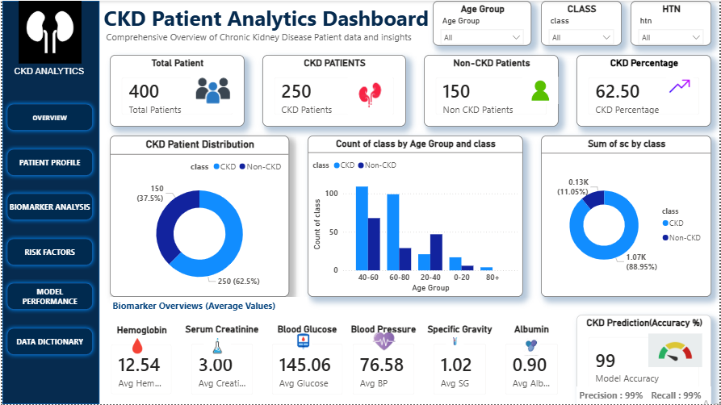

## Dashboard Preview



### Interactive Dashboard File

- Power BI Dashboard: `dashboard/powerbi/CKD_Dashboard.pbix`
  
# 🏥 Healthcare Chronic Disease Prediction & EHR Analysis

## 📌 Project Overview

This project focuses on analyzing anonymized Electronic Health Records (EHR) data to predict Chronic Kidney Disease (CKD) using Machine Learning techniques.

The project includes:

- 🧹 Data Cleaning & Preprocessing
- 📊 Exploratory Data Analysis (EDA)
- 🤖 Machine Learning Modeling
- 📈 Healthcare Dashboard Development
- 📑 Professional Documentation

---

# 🎯 Objectives

✅ Identify high-risk patients  
✅ Analyze important medical biomarkers  
✅ Build predictive healthcare models  
✅ Generate actionable healthcare insights 

---

# 🛠️ Tech Stack

| Category | Tools |
|---|---|
| Programming | Python |
| Data Analysis | Pandas, NumPy |
| Visualization | Matplotlib, Seaborn |
| Machine Learning | Scikit-Learn |
| Dashboard | Power BI / Tableau |
| Version Control | Git & GitHub |

---

# 📂 Project Structure

```text
healthcare-chronic-disease-analysis/
│
├── data/
├── notebooks/
├── scripts/
├── models/
├── visuals/
├── reports/
├── dashboard/
├── README.md
└── .gitignore
```

---

# 📊 Dataset

Dataset: Chronic Kidney Disease (CKD) Dataset  
Source: UCI Machine Learning Repository

---

# 🚀 Project Status

📅 Week 1 — 
# 📅 Day 1 — Environment Setup & Project Initialization

## 🎯 Objective

The objective of Day 1 was to establish the foundational infrastructure for the Healthcare Chronic Disease Prediction project using enterprise-grade development and version control practices.

This phase focused on preparing the development environment, organizing the project architecture, and initializing a professional GitHub workflow.

---

# 🛠️ Tasks Completed

✅ Created project repository  
✅ Initialized Git version control  
✅ Configured project folder architecture  
✅ Setup Anaconda environment  
✅ Installed required Python libraries  
✅ Configured VS Code + Jupyter workflow  
✅ Created notebook and script structure  
✅ Added professional `.gitignore`  
✅ Created initial README documentation  

---

# 🧱 Project Structure Initialization

The following professional directory structure was created:

```text
healthcare-chronic-disease-analysis/
│
├── data/
│   ├── raw/
│   ├── processed/
│   └── external/
│
├── notebooks/
├── scripts/
├── models/
├── visuals/
├── reports/
├── dashboard/
│
├── README.md
├── requirements.txt
└── .gitignore
```

---

# ⚙️ Environment Configuration

## Anaconda Environment

A dedicated Conda environment was created for isolated dependency management.

```bash
conda create -n healthcare-analytics python=3.11
```

Environment activation:

```bash
conda activate healthcare-analytics
```

---

# 📦 Libraries Installed

The following libraries were installed for healthcare analytics and machine learning workflows:

```text
pandas
numpy
matplotlib
seaborn
scikit-learn
scipy
imbalanced-learn
jupyter
```

---

# 💻 Development Workflow

The development workflow was configured using:

- VS Code
- Jupyter Notebook
- Git Bash
- GitHub

This setup enables:

✅ Reproducible analysis  
✅ Professional Git version control  
✅ Notebook-based experimentation  
✅ Structured project management  

---

# 🔐 Git & GitHub Configuration

## Repository Initialization

Git version control was initialized locally and connected to GitHub for continuous contribution tracking.

## Branching Workflow

A professional branching strategy was planned to separate:

- Data cleaning
- EDA
- Modeling
- Dashboard development

---

# 🧹 .gitignore Configuration

A professional `.gitignore` file was added to exclude:

- Raw datasets
- Temporary notebook files
- Environment variables
- Cache files
- Large binary outputs

This ensures a clean and secure repository structure.

---

# 📑 Initial Documentation

An initial `README.md` file was created containing:

- Project overview
- Objectives
- Technology stack
- Folder structure
- Dataset information

---

# 📌 Professional Practices Followed

The following enterprise-grade practices were established from Day 1:

✅ Semantic Git commit messages  
✅ Modular project structure  
✅ Daily contribution workflow  
✅ Secure dataset handling  
✅ Environment isolation using Conda  
✅ Documentation-first approach  

---
# 📅 Day 2 — Dataset Collection & Understanding

## 🎯 Objective

The objective of Day 2 was to collect, inspect, and understand the Chronic Kidney Disease (CKD) dataset before beginning preprocessing and analysis.

---

# 📂 Dataset Acquisition

## Dataset Used
Chronic Kidney Disease Dataset

## Source
UCI Machine Learning Repository

## Original Format
`.arff`

The dataset was initially provided in ARFF format and later converted into CSV format for easier preprocessing, analysis, and dashboard integration.

---

# 🛠️ Tasks Completed

✅ Downloaded CKD dataset  
✅ Read dataset documentation  
✅ Loaded dataset into Jupyter Notebook  
✅ Converted ARFF file into Pandas DataFrame  
✅ Decoded categorical byte values  
✅ Exported processed CSV dataset  
✅ Performed initial inspection and validation  

---

# 📊 Initial Dataset Inspection

The following checks were performed:

- Dataset shape
- Column names
- Data types
- Missing values
- Target variable distribution
- Unique categorical values

---

# 🔍 Key Observations

- Several medical attributes contain missing values
- Some categorical columns were encoded as byte strings
- A few columns required datatype correction
- Dataset contains both numerical and categorical healthcare variables

---

# 🧹 Initial Processing Performed

## ARFF Conversion
The dataset was converted from ARFF format into a Pandas DataFrame using Scipy.

## Byte Decoding
Categorical byte values were decoded into readable string format.

## CSV Export
A clean intermediate CSV file was exported for downstream preprocessing.

---

# 📁 Output Files Generated

```text
data/raw/chronic_kidney_disease.arff
data/processed/ckd_clean_initial.csv
```
---
# 📅 Day 3 — Missing Value Handling & Data Preprocessing

## 🎯 Objective

The objective of Day 3 was to clean the healthcare dataset by handling missing values, correcting invalid entries, standardizing data types, and preparing the dataset for exploratory analysis and machine learning.

---

# 🛠️ Tasks Completed

✅ Identified missing value patterns  
✅ Removed unwanted columns  
✅ Replaced invalid symbols with null values  
✅ Corrected inconsistent data types  
✅ Applied median imputation for numerical features  
✅ Applied mode imputation for categorical features  
✅ Validated cleaned dataset integrity  
✅ Exported finalized cleaned dataset  

---

# 🔍 Missing Value Assessment

A detailed missing value analysis was performed using:

- `df.isnull().sum()`
- Missing value heatmaps
- Column-wise inspection

Several healthcare biomarker columns contained missing observations, including:

- Red Blood Cell Count
- White Blood Cell Count
- Sodium
- Potassium
- Hemoglobin

---

# ⚠️ Invalid Data Handling

The dataset contained invalid placeholders such as:

```text
?
\\t?
blank spaces
```

These values were replaced with proper `NaN` entries to ensure accurate preprocessing.

---

# 🔄 Data Type Correction

Several numerical medical attributes were incorrectly stored as object/string types.

The following preprocessing steps were performed:

- Removed hidden spaces
- Converted columns using `pd.to_numeric()`
- Coerced invalid entries into missing values

---

# 📊 Numerical Imputation Strategy

## Median Imputation

Median imputation was applied to numerical healthcare attributes.

### Why Median?

Healthcare biomarker data often contains:

- Outliers
- Skewed distributions
- Extreme medical values

Median is more robust than mean and prevents distortion of clinical measurements.

---

# 🧩 Categorical Imputation Strategy

## Mode Imputation

Mode imputation was used for categorical medical variables because it preserves the most frequently observed category while maintaining dataset consistency.

---

# 🧹 Additional Cleaning

The following additional preprocessing tasks were completed:

- Duplicate record inspection
- Removal of unnecessary unnamed columns
- Dataset validation after imputation

---

# 📁 Output Files Generated

```text
data/processed/ckd_cleaned.csv
```

---

# 📌 Final Validation

The cleaned dataset was validated to ensure:

✅ No critical missing values remain  
✅ Correct data types are assigned  
✅ Dataset is ready for EDA and ML workflows  

---

# 💻 Technologies Used

- Python
- Pandas
- NumPy
- Matplotlib
- Seaborn

---

# 📅 Day 4 — Exploratory Data Analysis (EDA)

## 🎯 Objective

The objective of Day 4 was to perform Exploratory Data Analysis (EDA) on the cleaned Chronic Kidney Disease (CKD) dataset in order to identify important healthcare patterns, biomarker relationships, feature distributions, and potential risk indicators before machine learning preparation.

---

# 🛠️ Tasks Completed

✅ Loaded cleaned healthcare dataset  
✅ Performed statistical dataset overview  
✅ Analyzed CKD target variable distribution  
✅ Visualized numerical feature distributions  
✅ Conducted outlier inspection using boxplots  
✅ Generated healthcare biomarker correlation heatmap  
✅ Compared healthy vs diseased patient groups  
✅ Documented key healthcare insights  

---

# 📂 Dataset Used

```text
data/processed/ckd_cleaned.csv
```

The cleaned dataset generated during Day 3 preprocessing was used for exploratory analysis.

---

# 📊 Dataset Overview

The following inspections were performed:

- Dataset shape analysis
- Data type verification
- Descriptive statistics
- Numerical feature summaries
- Categorical feature assessment

---

# 🧠 Target Variable Analysis

The CKD target variable distribution was analyzed to understand the balance between:

- CKD Positive Patients
- CKD Negative Patients

A countplot visualization was generated to inspect disease prevalence within the dataset.

---

# 📈 Feature Distribution Analysis

Histogram visualizations were created to analyze the distribution of healthcare biomarkers such as:

- Blood Pressure
- Hemoglobin
- Serum Creatinine
- Blood Glucose
- Sodium
- Potassium

This analysis helped identify:

✅ Skewed distributions  
✅ Feature spread  
✅ Abnormal clinical ranges  
✅ Potential outliers  

---

# 📦 Outlier Inspection

Boxplots were generated for numerical healthcare features to inspect the presence of extreme biomarker values.

### Key Observation

Healthcare datasets naturally contain abnormal biomarker measurements due to clinical conditions. Outlier inspection was performed to understand data variability before machine learning modeling.

---

# 🔥 Correlation Analysis

A healthcare biomarker correlation heatmap was generated to identify relationships between medical variables.

## Important Note

A temporary encoded copy of the dataset was created because correlation matrices require numerical feature representations.

The original healthcare dataset remained unchanged during this process.

---

# 🔍 Disease vs Healthy Patient Analysis

Comparative visualizations were created between:

- CKD Positive Patients
- Healthy Patients

This helped identify biomarkers strongly associated with chronic kidney disease risk.

Example analyses included:

- Hemoglobin distribution
- Serum creatinine comparison
- Blood pressure variation

---

# 📌 Key EDA Findings

### Observed Insights

- CKD patients generally showed abnormal biomarker distributions
- Serum creatinine exhibited strong disease association
- Hemoglobin levels were comparatively lower in CKD-positive patients
- Several healthcare features displayed visible correlations
- Outliers were present across multiple medical attributes

---

# 📊 Visualizations Generated

The following visualizations were created:

✅ Histograms  
✅ Countplots  
✅ Boxplots  
✅ Correlation Heatmaps  
✅ Disease Comparison Plots  
✅ Distribution Analysis Charts  

---

# 💻 Technologies Used

- Python
- Pandas
- Matplotlib
- Seaborn

---

# 📅 Day 5 — Advanced Exploratory Data Analysis (Advanced EDA)

## 🎯 Objective

The objective of Day 5 was to perform advanced exploratory analysis on the Chronic Kidney Disease (CKD) dataset in order to identify deeper clinical relationships, biomarker distributions, disease patterns, and patient risk indicators before feature engineering and machine learning preparation.

---

# 🛠️ Tasks Completed

✅ Performed advanced disease vs healthy patient comparison  
✅ Analyzed serum creatinine distributions  
✅ Investigated blood pressure variations across CKD classes  
✅ Examined blood glucose biomarker behavior  
✅ Generated KDE distribution visualizations  
✅ Created violin plots for biomarker density analysis  
✅ Exported important healthcare EDA visualizations  
✅ Identified and corrected inconsistent target labels  
✅ Documented clinical observations and statistical insights  

---

# 📂 Dataset Used

```text
data/processed/ckd_cleaned.csv
```

The cleaned healthcare dataset generated from preprocessing workflows was used for advanced exploratory analysis.

---

# 🔍 Disease vs Healthy Patient Analysis

Comparative visual analysis was performed between:

- CKD Positive Patients
- Healthy Patients

The objective was to identify biomarkers strongly associated with chronic kidney disease risk.

---

# 🧪 Serum Creatinine Analysis

Serum creatinine distributions were analyzed using:

- Boxplots
- Violin plots

### Key Observation

CKD-positive patients exhibited significantly elevated serum creatinine levels, indicating strong association with kidney dysfunction.

Extreme outlier values were observed in severe CKD cases, requiring adjusted visualization scaling for improved readability.

---

# ❤️ Blood Pressure Analysis

Blood pressure distributions were compared across disease groups.

### Observation

Patients diagnosed with CKD demonstrated comparatively higher blood pressure variability than healthy patients, indicating moderate clinical association with kidney disease progression.

---

# 🍬 Blood Glucose Analysis

Random blood glucose distributions were explored across patient categories.

### Observation

Blood glucose measurements displayed variability between healthy and diseased cohorts, suggesting possible metabolic relationships within the dataset.

---

# 📈 KDE Distribution Analysis

Kernel Density Estimation (KDE) plots were generated for important biomarkers such as hemoglobin.

### Purpose

KDE visualizations provided smoother probability density analysis and improved understanding of feature distributions across CKD classes.

---

# 🎻 Violin Plot Analysis

Violin plots were used to inspect healthcare biomarker density and spread.

### Benefits

These visualizations combined:

- Distribution analysis
- Density estimation
- Median behavior
- Outlier visibility

This improved clinical interpretability of patient biomarker behavior.

---

# ⚠️ Outlier Analysis

Advanced outlier inspection revealed the presence of extreme clinical biomarker values among CKD-positive patients.

### Important Observation

Healthcare datasets naturally contain abnormal clinical measurements due to disease severity and patient variability.

Visualization scaling techniques were applied to improve graph readability while preserving clinical information.

---

# 🧹 Target Variable Correction

During EDA, an inconsistent target label (`no`) was identified in the dataset.

The CKD target variable was standardized to maintain only valid classes:

```text
ckd
notckd
```

This ensured consistent downstream machine learning preparation.

---

# 📊 Visualizations Generated

The following professional healthcare EDA visualizations were generated and exported:

✅ CKD Class Distribution  
✅ Hemoglobin Distribution  
✅ Serum Creatinine Distribution  
✅ Blood Pressure Distribution  
✅ Hemoglobin KDE Plot  
✅ Healthcare Outlier Boxplots  
✅ Biomarker Pairplots  

---

# 📁 Visualization Export Directory

```text
visuals/plots/
```

Important visualization assets were exported for reporting, dashboard development, and final project documentation.

---

# 📌 Key Clinical Insights

### Observed Findings

- CKD-positive patients showed elevated serum creatinine levels
- Hemoglobin distributions differed significantly across patient groups
- Blood pressure variability was higher among diseased patients
- Multiple healthcare biomarkers displayed strong disease association
- Outliers were clinically meaningful and expected within healthcare datasets
- Target label inconsistencies were successfully identified during exploratory analysis

---

# 💻 Technologies Used

- Python
- Pandas
- Matplotlib
- Seaborn

---

# 📅 Day 6 — Feature Engineering & Categorical Encoding

## 🎯 Objective

The objective of Day 6 was to initiate the feature engineering workflow by transforming the cleaned healthcare dataset into a machine learning compatible format through categorical encoding and dataset validation.

This phase focused on preparing the Chronic Kidney Disease (CKD) dataset for downstream machine learning preprocessing and predictive modeling.

---

# 🛠️ Tasks Completed

✅ Loaded cleaned healthcare dataset  
✅ Performed dataset validation checks  
✅ Verified missing values and data types  
✅ Standardized column formatting  
✅ Identified categorical healthcare features  
✅ Applied Label Encoding to categorical variables  
✅ Validated encoded dataset structure  
✅ Exported encoded healthcare dataset  

---

# 📂 Dataset Used

```text
data/processed/ckd_cleaned.csv
```

The cleaned dataset generated from previous preprocessing and EDA workflows was used as the foundation for feature engineering.

---

# 🔍 Dataset Validation

Before transformation, the following validation checks were performed:

- Dataset shape verification
- Missing value assessment
- Data type inspection
- Column consistency validation

These checks ensured that the dataset remained clean and stable before machine learning preparation.

---

# 🧹 Column Standardization

Hidden spaces and formatting inconsistencies were removed from column names to maintain:

✅ Clean feature naming  
✅ Consistent preprocessing workflow  
✅ Reliable downstream feature referencing  

---

# 🧩 Categorical Feature Identification

Categorical healthcare variables were identified using datatype inspection.

Examples of categorical features included:

- Red Blood Cells
- Pus Cell
- Hypertension
- Diabetes Mellitus
- Appetite
- Anemia

These features required numerical conversion before machine learning implementation.

---

# 🔄 Label Encoding

Machine learning algorithms require numerical feature representations. Therefore, categorical healthcare variables were transformed into numerical labels using Label Encoding.

### Example Transformations

```text
yes → 1
no → 0

present → 1
notpresent → 0
```

---

# 📌 Encoding Rationale

Label Encoding was selected because:

- The dataset contains multiple binary healthcare variables
- Machine learning models cannot process string values directly
- Numerical encoding improves compatibility with predictive algorithms

---

# 📊 Encoded Dataset Validation

After encoding, the transformed dataset was validated to ensure:

✅ Successful numerical conversion  
✅ No unexpected categorical remnants  
✅ Stable dataset structure  
✅ Machine learning compatibility  

---

# 📁 Output Files Generated

```text
data/processed/ckd_encoded.csv
```

The encoded dataset was exported for the next preprocessing phase involving feature standardization and scaling.

---

# 💻 Technologies Used

- Python
- Pandas
- Scikit-Learn

---
# 📅 Day 7 — Feature Standardization & Scaled Dataset Preparation

## 🎯 Objective

The objective of Day 7 was to standardize healthcare biomarker features and prepare a numerically balanced dataset suitable for machine learning model training.

This phase focused on scaling healthcare variables to ensure stable model convergence, improved feature comparability, and optimized machine learning performance.

---

# 🛠️ Tasks Completed

✅ Loaded encoded healthcare dataset  
✅ Separated feature variables and target label  
✅ Applied StandardScaler to numerical features  
✅ Standardized healthcare biomarker distributions  
✅ Validated scaled feature outputs  
✅ Analyzed feature distributions after scaling  
✅ Generated scaled feature correlation analysis  
✅ Exported standardized healthcare dataset  

---

# 📂 Dataset Used

```text
data/processed/ckd_encoded.csv
```

The encoded healthcare dataset generated during Day 6 was used for feature standardization and scaling workflows.

---

# 🔍 Dataset Preparation

Before scaling, the dataset was divided into:

- Feature Variables (`X`)
- Target Variable (`y`)

This separation ensured that only input features were standardized while preserving the original target labels.

---

# 📏 Feature Standardization

Healthcare biomarkers naturally operate on different numerical scales.

### Example

```text
Blood Pressure → 80–180
Hemoglobin → 10–20
White Blood Cell Count → Thousands
```

Without scaling, machine learning algorithms may assign disproportionate importance to larger numerical features.

---

# ⚙️ StandardScaler Implementation

The `StandardScaler` technique from Scikit-Learn was used to normalize feature distributions.

### Standardization Formula


::contentReference[oaicite:0]{index=0}


Where:

- \(x\) = original feature value
- \(\mu\) = feature mean
- \(\sigma\) = feature standard deviation

---

# 📌 Standardization Benefits

Feature scaling improves:

✅ Model convergence speed  
✅ Numerical stability  
✅ Feature comparability  
✅ Predictive consistency  
✅ Optimization efficiency  

---

# 📊 Scaled Feature Analysis

After standardization, feature distributions were inspected using:

- Histograms
- Distribution plots
- Correlation analysis

This validation confirmed that features were properly transformed and numerically balanced.

---

# 🔥 Correlation Validation

A correlation matrix was generated on the scaled feature dataset to verify:

- Feature relationships
- Biomarker dependencies
- Data consistency after scaling

The analysis confirmed that scaling preserved important healthcare feature relationships.

---

# 📁 Output Files Generated

```text
data/processed/ckd_scaled.csv
```

The standardized dataset was exported for the next preprocessing phase involving class balancing and final ML-ready dataset preparation.

---

# 💻 Technologies Used

- Python
- Pandas
- Scikit-Learn
- Matplotlib
- Seaborn

---
# 📅 Day 8 — Class Balancing & ML-Ready Dataset Preparation

## 🎯 Objective

The objective of Day 8 was to address class imbalance within the Chronic Kidney Disease (CKD) dataset and finalize a machine learning-ready healthcare dataset suitable for predictive modeling workflows.

This phase focused on balancing disease classes using SMOTE oversampling, validating class distributions, and exporting the finalized dataset for downstream machine learning implementation.

---

# 🛠️ Tasks Completed

✅ Loaded standardized healthcare dataset  
✅ Separated feature variables and target labels  
✅ Analyzed CKD class imbalance  
✅ Applied SMOTE oversampling technique  
✅ Balanced minority disease class samples  
✅ Validated resampled class distributions  
✅ Created finalized ML-ready healthcare dataset  
✅ Exported preprocessing artifacts for reproducibility  

---

# 📂 Dataset Used

```text
data/processed/ckd_scaled.csv
```

The standardized healthcare dataset generated during Day 7 preprocessing was used for class balancing and ML preparation.

---

# ⚠️ Class Imbalance Analysis

Before machine learning implementation, the CKD target variable distribution was analyzed.

### Observation

The dataset exhibited moderate imbalance between:

- CKD Positive Patients
- Healthy Patients

Class imbalance can negatively affect predictive model performance by biasing models toward the majority class.

---

# 🧠 Why Class Balancing Matters

In healthcare machine learning systems:

❌ Imbalanced datasets can reduce disease detection capability  
❌ Minority disease cases may be underrepresented  
❌ Predictive bias may increase false negatives  

This is especially critical in healthcare applications where failing to identify a diseased patient may have severe clinical consequences.

---

# ⚙️ SMOTE Implementation

The Synthetic Minority Oversampling Technique (SMOTE) was implemented to generate synthetic minority class samples and balance the healthcare dataset.

### SMOTE Concept

SMOTE creates synthetic feature samples by interpolating between existing minority class observations.

This improves:

✅ Dataset balance  
✅ Model fairness  
✅ Disease prediction sensitivity  
✅ Minority class representation  

---

# 📊 Class Distribution Validation

Target class distributions were validated:

- Before SMOTE
- After SMOTE

The balanced dataset confirmed equal representation of CKD-positive and healthy patient samples.

---

# 🔍 ML-Ready Dataset Construction

After balancing:

- Feature variables were reconstructed
- Target labels were reattached
- Dataset integrity was validated

This resulted in a fully machine learning compatible healthcare dataset.

---

# 📁 Output Files Generated

```text
data/processed/ckd_ml_ready.csv
models/standard_scaler.pkl
```

The finalized ML-ready dataset and preprocessing artifacts were exported for downstream model training and deployment workflows.

---

# 💻 Technologies Used

- Python
- Pandas
- Scikit-Learn
- Imbalanced-Learn (SMOTE)

---

# 📅 Day 9 — Baseline Model Building Using Logistic Regression

## 🎯 Objective

The objective of Day 9 was to begin the machine learning modeling phase by implementing a baseline Logistic Regression classifier for Chronic Kidney Disease (CKD) prediction.

This phase focused on preparing the ML-ready dataset for supervised learning, performing train-test splitting, generating baseline predictions, and evaluating initial model performance.

---

# 🛠️ Tasks Completed

✅ Loaded ML-ready healthcare dataset  
✅ Verified dataset structure and class distribution  
✅ Separated feature variables and target labels  
✅ Performed train-test split using stratification  
✅ Implemented Logistic Regression classifier  
✅ Trained baseline machine learning model  
✅ Generated patient predictions  
✅ Evaluated baseline classification performance  
✅ Created confusion matrix visualization  
✅ Exported baseline evaluation results  

---

# 📂 Dataset Used

```text
data/processed/ckd_ml_ready.csv
```

The ML-ready dataset generated during feature engineering and preprocessing workflows was used for baseline model training.

---

# 🤖 Machine Learning Approach

## Baseline Classifier

Logistic Regression was selected as the baseline machine learning algorithm because it is:

- Interpretable
- Computationally efficient
- Suitable for binary classification
- Commonly used in healthcare prediction systems

The model was trained to classify:

```text
CKD Positive Patients
vs
Healthy Patients
```

---

# 🔀 Train-Test Split Strategy

The healthcare dataset was divided into:

- Training Dataset → 80%
- Testing Dataset → 20%

Stratification was applied to preserve class balance across CKD-positive and healthy patient groups.

---

# 📊 Dataset Validation

The following validation checks were performed before model training:

✅ Dataset shape verification  
✅ Feature-target separation  
✅ Class distribution analysis  
✅ Training/testing size validation  

---

# 🧠 Model Training

A Logistic Regression classifier was initialized and trained using the healthcare biomarker dataset.

### Model Workflow

```text
ML-ready Dataset
↓
Train-Test Split
↓
Model Training
↓
Predictions
↓
Evaluation
```

---

# 🔍 Initial Predictions

The trained baseline model generated predictions on unseen patient records from the testing dataset.

This simulated real-world healthcare classification scenarios where the model predicts whether a patient is likely to have Chronic Kidney Disease.

---

# 📈 Baseline Model Evaluation

The Logistic Regression classifier was evaluated using:

- Accuracy Score
- Classification Report
- Confusion Matrix

These metrics provided insight into the model’s ability to correctly identify CKD-positive and healthy patients.

---

# 🔥 Confusion Matrix Analysis

A confusion matrix visualization was generated to analyze:

- True Positives
- True Negatives
- False Positives
- False Negatives

This evaluation is particularly important in healthcare machine learning because false negative predictions may delay clinical intervention.

---

# 📁 Output Files Generated

```text
reports/logistic_regression_baseline_results.csv
```

The baseline model evaluation results were exported for future model comparison and optimization workflows.

---

# 💻 Technologies Used

- Python
- Pandas
- Scikit-Learn
- Matplotlib
- Seaborn

---

# 🚀 Next Steps

The next modeling phase will focus on:

- Decision Tree Classifier
- Random Forest Classifier
- K-Nearest Neighbors (KNN)
- Hyperparameter Tuning
- Advanced Model Comparison

---

# 🔐 Professional Notes

- Stratified train-test splitting was applied to preserve class balance
- The target variable was intentionally excluded from preprocessing transformations
- Baseline evaluation metrics were documented for future model comparison
- The workflow remains fully reproducible and modular
- Semantic Git commits and professional notebook documentation practices were maintained consistently

---
# 📅 Day 10 — Decision Tree Modeling & Healthcare Classification Analysis

## 🎯 Objective

The objective of Day 10 was to implement and evaluate a Decision Tree classifier for Chronic Kidney Disease (CKD) prediction using the ML-ready healthcare dataset.

This phase focused on supervised learning implementation, healthcare classification analysis, decision boundary visualization, model comparison, and overfitting inspection.

---

# 🛠️ Tasks Completed

✅ Loaded ML-ready healthcare dataset  
✅ Performed feature-target separation  
✅ Applied train-test split with stratification  
✅ Implemented Decision Tree classifier  
✅ Trained healthcare prediction model  
✅ Generated predictions on unseen patient data  
✅ Calculated baseline Decision Tree accuracy  
✅ Generated classification report  
✅ Created confusion matrix visualization  
✅ Visualized Decision Tree structure  
✅ Compared Decision Tree with Logistic Regression  
✅ Performed overfitting analysis  
✅ Exported model comparison results  

---

# 📂 Dataset Used

```text
data/processed/ckd_ml_ready.csv
```

The ML-ready healthcare dataset generated during preprocessing and feature engineering workflows was used for predictive modeling.

---

# 🌳 Decision Tree Modeling

A Decision Tree classifier was implemented to model healthcare decision pathways associated with Chronic Kidney Disease prediction.

Decision Trees are effective for healthcare analytics because they:

- Capture non-linear feature relationships
- Provide interpretable prediction logic
- Handle complex biomarker interactions
- Support visual explanation of clinical decision rules

---

# 🔀 Train-Test Split Strategy

The dataset was divided into:

- Training Dataset → 80%
- Testing Dataset → 20%

Stratification was applied to preserve CKD class balance across training and testing datasets.

This ensured stable and unbiased model evaluation.

---

# 📊 Model Training Workflow

The machine learning workflow followed:

```text
ML-ready Dataset
↓
Feature-Target Separation
↓
Train-Test Split
↓
Decision Tree Training
↓
Predictions
↓
Evaluation
```

---

# 🔍 Initial Predictions

The trained Decision Tree classifier generated predictions on unseen patient records from the testing dataset.

This simulated real-world healthcare classification scenarios where the system predicts whether a patient is likely to develop Chronic Kidney Disease.

---

# 📈 Model Evaluation

The Decision Tree classifier was evaluated using:

- Accuracy Score
- Classification Report
- Confusion Matrix

These evaluation metrics helped assess the model’s ability to correctly classify:

- CKD-positive patients
- Healthy patients

---

# 🔥 Confusion Matrix Analysis

A confusion matrix visualization was generated to analyze:

- True Positives
- True Negatives
- False Positives
- False Negatives

This analysis is critical in healthcare machine learning because false negative predictions may delay medical intervention for high-risk patients.

---

# 🌲 Decision Tree Visualization

The complete Decision Tree structure was visualized to inspect:

- Biomarker splitting conditions
- Clinical decision boundaries
- Feature selection pathways
- Healthcare classification logic

This improved model interpretability and explainability.

---

# ⚠️ Overfitting Analysis

Training and testing accuracies were compared to evaluate model generalization capability.

### Important Observation

If training accuracy becomes significantly higher than testing accuracy, the model may be overfitting the healthcare dataset by memorizing patterns rather than learning generalized clinical relationships.

---

# 📉 Model Comparison

The Decision Tree classifier was compared with the baseline Logistic Regression model to evaluate:

- Prediction performance
- Classification stability
- Healthcare decision complexity
- Accuracy differences

This comparison established benchmarking for future advanced models.

---

# 📁 Output Files Generated

```text
reports/decision_tree_results.csv
```

The evaluation and comparison results were exported for future model benchmarking and reporting workflows.

---

# 💻 Technologies Used

- Python
- Pandas
- Scikit-Learn
- Matplotlib
- Seaborn

---

# 🚀 Next Steps

The next machine learning phase will focus on:

- Random Forest Classifier
- K-Nearest Neighbors (KNN)
- Hyperparameter Tuning
- ROC-AUC Evaluation
- Advanced Healthcare Model Comparison

---

# 🔐 Professional Notes

- Stratified splitting preserved CKD class balance
- Decision Tree visualization improved healthcare model interpretability
- Overfitting analysis was performed using train-test accuracy comparison
- Baseline benchmarking against Logistic Regression was maintained
- Semantic Git commits and modular notebook workflows were consistently followed
- Exported evaluation files support reproducible healthcare analytics workflows

---

# 📅 Day 11 — Random Forest Modeling & Feature Importance Analysis

## 🎯 Objective

The objective of Day 11 was to implement and evaluate a Random Forest classifier for Chronic Kidney Disease (CKD) prediction using the ML-ready healthcare dataset.

This phase focused on ensemble learning, healthcare biomarker importance analysis, prediction stability evaluation, and comparison with previously implemented machine learning models.

---

# 🛠️ Tasks Completed

✅ Loaded ML-ready healthcare dataset  
✅ Performed feature-target separation  
✅ Applied stratified train-test split  
✅ Implemented Random Forest classifier  
✅ Trained ensemble healthcare prediction model  
✅ Generated predictions on unseen patient data  
✅ Calculated Random Forest classification accuracy  
✅ Generated classification report  
✅ Created confusion matrix visualization  
✅ Evaluated healthcare biomarker importance  
✅ Visualized top contributing features  
✅ Analyzed ensemble learning behavior  
✅ Compared Random Forest with baseline models  
✅ Exported feature importance and comparison reports  

---

# 📂 Dataset Used

```text
data/processed/ckd_ml_ready.csv
```

The ML-ready healthcare dataset generated during preprocessing and feature engineering workflows was used for ensemble machine learning implementation.

---

# 🌲 Random Forest Modeling

A Random Forest classifier was implemented to improve Chronic Kidney Disease prediction performance using ensemble learning techniques.

Random Forest combines multiple Decision Trees to improve:

- Prediction stability
- Generalization capability
- Resistance to overfitting
- Healthcare classification robustness

---

# 🔀 Train-Test Split Strategy

The dataset was divided into:

- Training Dataset → 80%
- Testing Dataset → 20%

Stratification was applied to preserve CKD class balance across both datasets.

This ensured fair and unbiased healthcare model evaluation.

---

# 📊 Ensemble Learning Workflow

The machine learning workflow followed:

```text
ML-ready Dataset
↓
Feature-Target Separation
↓
Train-Test Split
↓
Random Forest Training
↓
Predictions
↓
Evaluation
↓
Feature Importance Analysis
```

---

# 🔍 Initial Predictions

The trained Random Forest classifier generated predictions on unseen patient records from the testing dataset.

This simulated real-world healthcare classification scenarios where the system predicts whether a patient is likely to have Chronic Kidney Disease.

---

# 📈 Model Evaluation

The Random Forest classifier was evaluated using:

- Accuracy Score
- Classification Report
- Confusion Matrix

These metrics measured the model’s ability to correctly classify:

- CKD-positive patients
- Healthy patients

---

# 🔥 Confusion Matrix Analysis

A confusion matrix visualization was generated to analyze:

- True Positives
- True Negatives
- False Positives
- False Negatives

This evaluation is critical in healthcare analytics because false negative predictions may delay medical treatment for high-risk patients.

---

# 🧬 Feature Importance Analysis

Feature importance evaluation was performed to identify the healthcare biomarkers contributing most strongly to CKD prediction.

The Random Forest model automatically assigned importance scores to biomarkers based on their contribution to classification performance.

---

# 📊 Top Biomarker Analysis

Top healthcare biomarkers were visualized using feature importance bar charts.

### Important Observation

Clinical biomarkers such as:

- Serum Creatinine
- Hemoglobin
- Blood Pressure
- Blood Glucose

showed strong contribution to disease prediction performance.

---

# 🌐 Ensemble Learning Analysis

Random Forest improved healthcare classification stability by aggregating predictions from multiple Decision Trees.

### Ensemble Learning Benefits

- Reduced overfitting risk
- Improved prediction robustness
- Better generalization capability
- More stable healthcare predictions

---

# 📉 Model Comparison

The Random Forest classifier was compared with:

- Logistic Regression
- Decision Tree

to evaluate:

- Accuracy improvements
- Prediction consistency
- Healthcare classification reliability

---

# 📁 Output Files Generated

```text
reports/random_forest_feature_importance.csv
reports/random_forest_comparison_results.csv
```

The exported reports support future healthcare model benchmarking and dashboard workflows.

---

# 💻 Technologies Used

- Python
- Pandas
- Scikit-Learn
- Matplotlib
- Seaborn

---

# 🚀 Next Steps

The next machine learning phase will focus on:

- K-Nearest Neighbors (KNN)
- Hyperparameter Tuning
- ROC-AUC Evaluation
- Advanced Model Comparison
- Clinical Risk Interpretation

---

# 🔐 Professional Notes

- Stratified train-test splitting preserved CKD class balance
- Ensemble learning improved healthcare prediction stability
- Feature importance analysis improved model interpretability
- Model comparison workflows were maintained consistently
- Exported reports support reproducible healthcare analytics workflows
- Semantic Git commits and modular notebook practices were followed throughout the project

---

# 📅 Day 12 — K-Nearest Neighbors (KNN) Modeling & Distance-Based Healthcare Classification

## 🎯 Objective

The objective of Day 12 was to implement and evaluate a K-Nearest Neighbors (KNN) classifier for Chronic Kidney Disease (CKD) prediction using the ML-ready healthcare dataset.

This phase focused on distance-based learning, neighborhood analysis, K-value experimentation, healthcare classification performance evaluation, and comparison with previously implemented machine learning models.

---

# 🛠️ Tasks Completed

✅ Loaded ML-ready healthcare dataset  
✅ Performed feature-target separation  
✅ Applied stratified train-test split  
✅ Implemented K-Nearest Neighbors (KNN) classifier  
✅ Trained distance-based healthcare prediction model  
✅ Generated predictions on unseen patient data  
✅ Calculated KNN classification accuracy  
✅ Generated classification report  
✅ Created confusion matrix visualization  
✅ Experimented with multiple K values  
✅ Analyzed neighborhood-based learning behavior  
✅ Visualized K-value accuracy trends  
✅ Compared KNN with baseline machine learning models  
✅ Exported KNN evaluation and K-value analysis reports  

---

# 📂 Dataset Used

```text
data/processed/ckd_ml_ready.csv
```

The ML-ready healthcare dataset generated during preprocessing and feature engineering workflows was used for distance-based machine learning implementation.

---

# 🤝 K-Nearest Neighbors (KNN) Modeling

A K-Nearest Neighbors (KNN) classifier was implemented to classify healthcare records based on similarity with neighboring patient observations.

KNN is a distance-based machine learning algorithm that predicts patient classes using nearby data points in feature space.

---

# 🔀 Train-Test Split Strategy

The dataset was divided into:

- Training Dataset → 80%
- Testing Dataset → 20%

Stratification was applied to preserve CKD class balance across both datasets.

This ensured stable and unbiased healthcare model evaluation.

---

# 📊 Distance-Based Learning Workflow

The machine learning workflow followed:

```text
ML-ready Dataset
↓
Feature-Target Separation
↓
Train-Test Split
↓
KNN Training
↓
Predictions
↓
Evaluation
↓
K-Value Analysis
```

---

# 🔍 Initial Predictions

The trained KNN classifier generated predictions on unseen patient records from the testing dataset.

This simulated real-world healthcare prediction scenarios where patient classification is determined using similarity-based learning.

---

# 📈 Model Evaluation

The KNN classifier was evaluated using:

- Accuracy Score
- Classification Report
- Confusion Matrix

These metrics measured the model’s ability to correctly classify:

- CKD-positive patients
- Healthy patients

---

# 🔥 Confusion Matrix Analysis

A confusion matrix visualization was generated to analyze:

- True Positives
- True Negatives
- False Positives
- False Negatives

This evaluation is critical in healthcare analytics because false negative predictions may delay diagnosis and medical intervention.

---

# 🔢 K-Value Experimentation

Different K values were tested to evaluate how neighborhood size impacts healthcare classification performance.

### Purpose

K-value experimentation helped analyze:

- Prediction stability
- Model sensitivity
- Classification robustness
- Distance-based learning behavior

---

# 📊 K-Value Accuracy Analysis

K-value performance trends were visualized using line plots to identify the most effective neighborhood size for CKD classification.

### Important Observation

Very small K values may increase noise sensitivity, while excessively large K values may oversimplify healthcare decision boundaries.

---

# 🌐 Distance-Based Learning Analysis

KNN classifies healthcare records based on similarity with nearby patient observations in feature space.

### Important Note

Feature scaling performed during preprocessing was especially important because KNN relies heavily on distance calculations between healthcare biomarkers.

---

# 📉 Model Comparison

The KNN classifier was compared with:

- Logistic Regression
- Decision Tree
- Random Forest

to evaluate:

- Prediction performance
- Healthcare classification stability
- Model generalization capability
- Distance-based learning effectiveness

---

# 📁 Output Files Generated

```text
reports/knn_comparison_results.csv
reports/knn_k_value_analysis.csv
```

The exported reports support future healthcare model benchmarking and evaluation workflows.

---

# 💻 Technologies Used

- Python
- Pandas
- Scikit-Learn
- Matplotlib
- Seaborn

---

# 🚀 Next Steps

The next machine learning phase will focus on:

- Hyperparameter Tuning
- GridSearchCV Optimization
- ROC-AUC Evaluation
- Advanced Model Comparison
- Clinical Risk Interpretation

---

# 🔐 Professional Notes

- Stratified train-test splitting preserved CKD class balance
- Feature scaling significantly improved KNN performance reliability
- K-value experimentation improved model optimization understanding
- Distance-based learning analysis enhanced healthcare interpretability
- Exported reports support reproducible healthcare analytics workflows
- Semantic Git commits and modular notebook practices were consistently maintained

---

# 📅 Day 13 — Hyperparameter Tuning & Cross-Validation Optimization

## 🎯 Objective

The objective of Day 13 was to optimize the Random Forest classifier for Chronic Kidney Disease (CKD) prediction using hyperparameter tuning and cross-validation techniques.

This phase focused on improving healthcare prediction performance, validating model generalization capability, and selecting the best-performing machine learning configuration using GridSearchCV.

---

# 🛠️ Tasks Completed

✅ Loaded ML-ready scaled healthcare dataset  
✅ Performed feature-target separation  
✅ Applied stratified train-test split  
✅ Initialized baseline Random Forest classifier  
✅ Defined hyperparameter search space  
✅ Implemented GridSearchCV optimization  
✅ Performed 5-fold cross-validation  
✅ Identified best-performing hyperparameter configuration  
✅ Generated optimized healthcare predictions  
✅ Calculated optimized model accuracy  
✅ Generated classification report  
✅ Created optimized confusion matrix visualization  
✅ Evaluated cross-validation performance metrics  
✅ Analyzed top-performing hyperparameter combinations  
✅ Exported optimization and tuning reports  
✅ Saved optimized Random Forest model  

---

# 📂 Dataset Used

```text
data/processed/ckd_scaled.csv
```

The scaled healthcare dataset generated during feature engineering workflows was used for hyperparameter optimization and advanced machine learning evaluation.

---

# ⚙️ Hyperparameter Tuning

Hyperparameter tuning was performed using:

```text
GridSearchCV
```

This technique systematically tested multiple Random Forest parameter combinations to identify the best-performing healthcare classification model.

---

# 🔍 Hyperparameters Optimized

The following Random Forest hyperparameters were evaluated:

- Number of Estimators (`n_estimators`)
- Maximum Tree Depth (`max_depth`)
- Minimum Samples Split (`min_samples_split`)
- Minimum Samples Leaf (`min_samples_leaf`)

These parameters directly affect:

- Model complexity
- Prediction stability
- Generalization capability
- Overfitting behavior

---

# 🔄 Cross-Validation Strategy

A:

```text
5-Fold Cross-Validation
```

strategy was applied during optimization.

This ensured that the healthcare model was evaluated across multiple dataset splits instead of relying on a single validation subset.

---

# 📊 Cross-Validation Analysis

The optimized Random Forest classifier achieved:

```text
100% Cross-Validation Accuracy
```

during GridSearchCV evaluation.

### Important Interpretation

This indicates that the selected hyperparameter configuration performed consistently across multiple training-validation splits.

---

# 📈 Optimized Model Evaluation

After selecting the best hyperparameters, the optimized Random Forest model was evaluated on unseen patient records from the testing dataset.

### Optimized Testing Accuracy

```text
98.75%
```

This demonstrates strong healthcare classification performance and generalization capability.

---

# 🔥 Classification Report Analysis

The optimized model achieved strong:

- Precision
- Recall
- F1-score

across CKD-positive and healthy patient groups.

### Important Healthcare Insight

High recall performance is especially important in healthcare analytics because false negative predictions may delay diagnosis and medical treatment for high-risk CKD patients.

---

# 🧪 Confusion Matrix Analysis

The optimized confusion matrix showed:

- Strong true positive classification
- Strong true negative classification
- Minimal healthcare prediction errors

### Important Observation

Only a very small number of CKD-positive patient records were incorrectly classified, demonstrating strong clinical prediction reliability.

---

# 📋 Cross-Validation Results Analysis

The complete GridSearchCV cross-validation results were stored inside a DataFrame to analyze:

- Mean validation scores
- Hyperparameter ranking
- Model training consistency
- Optimization performance trends

This improved transparency and reproducibility of the optimization workflow.

---

# 📁 Output Files Generated

```text
reports/gridsearchcv_results.csv
reports/best_hyperparameters.csv
models/optimized_random_forest.pkl
```

The exported reports and optimized model support future healthcare evaluation, dashboarding, and deployment workflows.

---

# 💻 Technologies Used

- Python
- Pandas
- Scikit-Learn
- Matplotlib
- Seaborn
- Joblib

---

# 🚀 Next Steps

The next machine learning phase will focus on:

- ROC-AUC Evaluation
- Precision vs Recall Analysis
- Advanced Model Comparison
- Clinical Risk Interpretation
- Final Healthcare Reporting

---

# 🔐 Professional Notes

- Stratified train-test splitting preserved CKD class balance
- GridSearchCV improved healthcare model optimization reliability
- Cross-validation reduced risk of unstable evaluation
- Hyperparameter tuning improved generalization capability
- Optimized models were exported for reproducible healthcare analytics workflows
- Semantic Git commits and modular notebook workflows were consistently maintained

---

# 📅 Day 14 — Healthcare Model Evaluation & Comparative Performance Analysis

## 🎯 Objective

The objective of Day 14 was to perform comparative evaluation of multiple machine learning models developed for Chronic Kidney Disease (CKD) prediction.

This phase focused on analyzing healthcare model performance using multiple evaluation metrics, comparing prediction reliability, and identifying the most clinically effective classification approach.

---

# 🛠️ Tasks Completed

✅ Created healthcare model comparison framework  
✅ Compared machine learning accuracy scores  
✅ Compared precision performance across classifiers  
✅ Compared recall performance across classifiers  
✅ Evaluated F1-score performance  
✅ Generated comparative healthcare evaluation visualizations  
✅ Created combined metric comparison workflow  
✅ Transformed evaluation data using DataFrame melting  
✅ Identified best-performing healthcare prediction model  
✅ Analyzed clinical importance of recall in CKD prediction  
✅ Exported healthcare model comparison reports  

---

# 📂 Evaluation Workflow

The following healthcare prediction models were compared:

- Logistic Regression
- Decision Tree
- Random Forest
- K-Nearest Neighbors (KNN)
- Optimized Random Forest

Each model was evaluated using multiple healthcare-focused classification metrics.

---

# 📊 Evaluation Metrics Used

The comparative analysis focused on:

- Accuracy
- Precision
- Recall
- F1-score

These metrics were selected because healthcare machine learning systems require more than just high accuracy.

---

# 📈 Accuracy Comparison

Accuracy comparison was performed to evaluate the overall classification capability of each healthcare prediction model.

### Observation

- Logistic Regression and Decision Tree achieved very high classification accuracy
- Random Forest models demonstrated strong and stable performance
- KNN performed well but showed slightly lower stability compared to ensemble models

---

# 🎯 Precision Analysis

Precision evaluation measured how accurately CKD-positive predictions were made by each classifier.

### Healthcare Importance

High precision reduces unnecessary concern and medical testing for healthy patients incorrectly classified as CKD-positive.

---

# 🔍 Recall Analysis

Recall comparison was one of the most important healthcare evaluation steps in the project.

### Important Clinical Interpretation

High recall is critical in healthcare analytics because:

```text
False negative predictions may delay treatment for high-risk CKD patients.
```

A strong recall score helps ensure that CKD-positive patients are correctly identified.

---

# ⚖️ F1-Score Analysis

F1-score evaluation balanced:

- Precision
- Recall

This metric helped assess overall healthcare classification reliability across all machine learning models.

---

# 🔄 Combined Metric Comparison

The evaluation workflow used:

```python
DataFrame.melt()
```

to transform healthcare evaluation metrics into long-format structure for grouped visualization analysis.

This improved:

- Comparative interpretability
- Visualization flexibility
- Metric grouping analysis

---

# 📊 Comparative Visualization Analysis

Multiple evaluation visualizations were generated to compare:

- Accuracy trends
- Precision trends
- Recall trends
- F1-score performance

across all healthcare machine learning models.

---

# 🏆 Best Performing Healthcare Model

The optimized Random Forest classifier demonstrated the most balanced healthcare classification performance because it combined:

- High accuracy
- Strong recall
- Stable ensemble learning behavior
- Reduced overfitting risk

---

# 🧪 Clinical Reliability Discussion

Although the healthcare models achieved very high evaluation scores, machine learning predictions remain probabilistic and may still generate:

- False positives
- False negatives

### Important Healthcare Consideration

False negatives are especially critical because missed CKD-positive patients may experience delayed diagnosis and treatment.

---

# 📁 Output Files Generated

```text
../reports/model_comparison_results.csv
../reports/model_metric_comparison.csv
```

The exported reports support future healthcare dashboarding and executive reporting workflows.

---

# 💻 Technologies Used

- Python
- Pandas
- Matplotlib
- Seaborn
- Scikit-Learn

---

# 🚀 Next Steps

The next phase of the project will focus on:

- ROC Curve Analysis
- ROC-AUC Evaluation
- Clinical Risk Visualization
- Power BI Dashboard Integration
- Executive Healthcare Reporting

---

# 🔐 Professional Notes

- Multiple healthcare evaluation metrics were analyzed instead of relying only on accuracy
- Recall interpretation was prioritized due to clinical importance
- Ensemble learning models demonstrated stronger prediction stability
- Comparative visualization workflows improved healthcare interpretability
- Exported evaluation reports support reproducible healthcare analytics workflows
- Semantic Git commits and modular notebook practices were consistently maintained

---

# 📅 Day 15 — Clinical Interpretation & Healthcare Risk Analysis

## 🎯 Objective

The objective of Day 15 was to clinically interpret the healthcare machine learning predictions generated during Chronic Kidney Disease (CKD) classification modeling.

This phase focused on analyzing healthcare prediction reliability, understanding false negative risks, evaluating recall importance, and discussing the real-world clinical implications of machine learning predictions.

---

# 🛠️ Tasks Completed

✅ Created clinical interpretation evaluation framework  
✅ Analyzed healthcare prediction outcomes  
✅ Evaluated false negative risks across classifiers  
✅ Compared recall performance between healthcare models  
✅ Interpreted healthcare prediction reliability  
✅ Categorized healthcare clinical risk levels  
✅ Generated recall comparison visualizations  
✅ Generated false negative comparison charts  
✅ Selected clinically reliable healthcare models  
✅ Created executive healthcare interpretation summary  
✅ Exported clinical interpretation reports  

---

# 📂 Clinical Evaluation Workflow

The following healthcare prediction models were clinically evaluated:

- Logistic Regression
- Decision Tree
- Random Forest
- K-Nearest Neighbors (KNN)
- Optimized Random Forest

The analysis focused on healthcare risk interpretation instead of only mathematical model performance.

---

# 🧪 Clinical Interpretation Analysis

Healthcare machine learning predictions were interpreted to understand the practical implications of CKD classification decisions.

This phase focused on evaluating:

- Clinical safety
- Prediction reliability
- Risk of incorrect diagnosis
- Healthcare decision support quality

---

# ⚠️ False Negative Analysis

False negative predictions occur when:

```text
A CKD-positive patient is incorrectly classified as healthy.
```

This is one of the most dangerous healthcare prediction errors because delayed diagnosis may increase patient risk and postpone medical treatment.

---

# 🔍 Recall Importance in Healthcare Analytics

Recall was identified as one of the most critical healthcare evaluation metrics in the project.

### Clinical Importance

A high recall score helps ensure that:

- CKD-positive patients are correctly identified
- High-risk patients are not missed
- Medical intervention can occur earlier

---

# 📊 Recall Comparison Analysis

Recall scores were compared across all healthcare machine learning models.

### Observation

- Logistic Regression and Decision Tree achieved perfect recall performance
- Random Forest models maintained strong recall stability
- KNN also demonstrated strong healthcare classification capability

---

# 📉 False Negative Comparison

False negative counts were compared to identify healthcare models with the lowest patient risk.

### Important Observation

Models with lower false negative counts are considered clinically safer because they reduce the probability of missing CKD-positive patients.

---

# 🏥 Clinical Risk Categorization

Healthcare models were categorized according to:

- Recall performance
- False negative count
- Prediction stability

This improved understanding of which machine learning models may be more reliable for healthcare decision-support systems.

---

# 🌲 Best Clinical Healthcare Model

The optimized Random Forest classifier demonstrated strong healthcare reliability because it combined:

- High classification accuracy
- Strong recall performance
- Low false negative risk
- Stable ensemble learning behavior

---

# 📈 Executive Healthcare Interpretation

An executive healthcare summary was generated to explain:

- Prediction reliability
- Clinical safety
- CKD risk identification capability
- Overall healthcare machine learning effectiveness

This improved the interpretability of the healthcare analytics workflow for non-technical stakeholders.

---

# 📁 Output Files Generated

```text
reports/clinical_interpretation_results.csv
reports/clinical_executive_summary.csv
```

The exported reports support future healthcare dashboarding and executive reporting workflows.

---

# 💻 Technologies Used

- Python
- Pandas
- Matplotlib
- Seaborn
- Scikit-Learn

---

# 🚀 Next Steps

The next phase of the project will focus on:

- ROC Curve Analysis
- ROC-AUC Evaluation
- Power BI Dashboard Integration
- Executive Healthcare Dashboard Design
- Final Project Documentation

---

# 🔐 Professional Notes

- Clinical interpretation focused on healthcare safety instead of only accuracy
- Recall analysis was prioritized due to medical importance
- False negative risk evaluation improved healthcare reliability understanding
- Ensemble learning models demonstrated strong prediction stability
- Executive healthcare summaries improved non-technical interpretability
- Semantic Git commits and modular notebook workflows were consistently maintained

---

# 📅 Day 16 — Confusion Matrix Analysis & Clinical Error Interpretation

## 🎯 Objective

The objective of Day 16 was to perform detailed confusion matrix analysis for Chronic Kidney Disease (CKD) prediction models and interpret the clinical implications of healthcare prediction errors.

This phase focused on understanding true positives, false negatives, prediction reliability, and the clinical impact of incorrect healthcare classifications.

---

# 🛠️ Tasks Completed

✅ Loaded optimized healthcare prediction model  
✅ Loaded ML-ready scaled healthcare dataset  
✅ Performed train-test splitting for evaluation workflow  
✅ Generated healthcare model predictions  
✅ Created confusion matrix  
✅ Visualized healthcare confusion matrix using heatmap  
✅ Extracted confusion matrix components  
✅ Analyzed true positives and false negatives  
✅ Interpreted healthcare prediction errors  
✅ Created healthcare error distribution visualization  
✅ Exported confusion matrix analysis report  

---

# 📂 Evaluation Workflow

The optimized Random Forest healthcare model was loaded using:

```python
joblib.load()
```

The evaluation workflow reused the saved machine learning model generated during hyperparameter tuning and model optimization.

---

# 🧠 Confusion Matrix Analysis

A confusion matrix was generated to analyze healthcare prediction performance.

The confusion matrix evaluated:

- Correct CKD predictions
- Incorrect CKD predictions
- Healthy patient classification
- Clinical prediction reliability

---

# 📊 Confusion Matrix Components

The following confusion matrix components were extracted:

- True Negatives (TN)
- False Positives (FP)
- False Negatives (FN)
- True Positives (TP)

These metrics improve understanding of healthcare classification behavior.

---

# ✅ True Positive Interpretation

True positives represent:

```text
CKD-positive patients correctly identified by the healthcare model.
```

A higher true positive count indicates stronger disease detection capability.

---

# ⚠️ False Negative Analysis

False negatives occur when:

```text
A CKD-positive patient is incorrectly classified as healthy.
```

This is one of the most critical healthcare prediction risks because delayed diagnosis may increase patient risk and postpone treatment.

---

# 🏥 Clinical Error Interpretation

Healthcare machine learning evaluation should focus not only on accuracy but also on the clinical impact of prediction errors.

### Important Clinical Insight

False negatives are generally considered more dangerous than false positives because missed CKD-positive patients may not receive timely medical attention.

---

# 📈 Visualization Analysis

The following healthcare visualizations were generated:

- Confusion Matrix Heatmap
- Error Distribution Bar Chart

These visualizations improved interpretability of healthcare prediction performance and model reliability.

---

# 🔄 Model Reloading Workflow

The optimized healthcare model was reloaded from:

```text
models/optimized_random_forest.pkl
```

This reflects professional production-style machine learning workflows where trained models are saved and reused during evaluation stages.

---

# 📁 Output Files Generated

```text
reports/confusion_matrix_analysis.csv
```

The exported confusion matrix report supports future dashboarding and executive healthcare reporting workflows.

---

# 💻 Technologies Used

- Python
- Pandas
- Matplotlib
- Seaborn
- Scikit-Learn
- Joblib

---

# 🚀 Next Steps

The next phase of the project will focus on:

- ROC Curve Analysis
- ROC-AUC Evaluation
- Precision vs Recall Tradeoff
- Executive Healthcare Dashboarding
- Power BI Integration

---

# 🔐 Professional Notes

- Real healthcare predictions were used instead of synthetic example data
- Saved machine learning models were reused through Joblib serialization
- Clinical interpretation focused on healthcare safety and prediction reliability
- False negative analysis improved understanding of healthcare risk
- Visualization workflows improved healthcare model interpretability
- Semantic Git commits and modular notebook practices were consistently maintained

---

# 📅 Day 17 — ROC Curve, AUC Analysis & Healthcare Model Discrimination

## 🎯 Objective

The objective of Day 17 was to evaluate the healthcare model's discrimination capability using ROC Curve analysis and ROC-AUC scoring for Chronic Kidney Disease (CKD) prediction.

This phase focused on understanding probability-based healthcare predictions, threshold behavior, classification sensitivity, and healthcare model reliability.

---

# 🛠️ Tasks Completed

✅ Loaded final preprocessed and scaled healthcare dataset  
✅ Loaded optimized Random Forest healthcare model  
✅ Performed healthcare prediction probability analysis  
✅ Generated ROC Curve metrics  
✅ Calculated ROC-AUC score  
✅ Visualized ROC Curve  
✅ Performed threshold analysis  
✅ Evaluated model discrimination capability  
✅ Interpreted healthcare prediction sensitivity  
✅ Exported ROC threshold analysis results  
✅ Exported ROC-AUC evaluation summary  

---

# 📂 Dataset & Model Workflow

The workflow used:

```text
data/processed/ckd_scaled.csv
```

as the final preprocessed and ML-ready healthcare dataset.

The optimized healthcare model was loaded from:

```text
models/optimized_random_forest.pkl
```

using Joblib serialization.

---

# 🧠 Prediction Probability Analysis

The healthcare model generated probability-based predictions using:

```python
predict_proba()
```

instead of only binary classifications.

### Important Interpretation

Prediction probabilities represent the model's confidence level when classifying CKD-positive and healthy patients.

Example:

```text
0.978
```

indicates very high confidence that a patient belongs to the CKD-positive class.

---

# 📊 ROC Curve Analysis

Receiver Operating Characteristic (ROC) analysis was performed to evaluate how effectively the healthcare model distinguishes:

- CKD-positive patients
- Healthy patients

across multiple classification thresholds.

---

# 📈 False Positive Rate (FPR)

False Positive Rate analysis measured how frequently healthy patients were incorrectly classified as CKD-positive.

### Observation

The healthcare model maintained very low false positive rates across most thresholds, indicating strong classification stability.

---

# 📈 True Positive Rate (TPR)

True Positive Rate analysis measured how effectively the healthcare model correctly identified CKD-positive patients.

### Observation

The healthcare model demonstrated strong sensitivity and maintained high true positive performance across threshold ranges.

---

# ⚖️ Threshold Analysis

Threshold analysis was performed to evaluate how changing classification thresholds affects:

- Healthcare sensitivity
- False positive risk
- Disease detection capability

This improved understanding of healthcare risk tradeoffs.

---

# 🏥 ROC-AUC Evaluation

The healthcare model achieved:

```text
ROC-AUC Score = 1.0
```

### Interpretation

This indicates extremely strong healthcare classification capability and near-perfect discrimination between CKD-positive and healthy patients within the current dataset.

---

# ⚠️ Important Real-World Interpretation

Although the ROC-AUC score was extremely high, real-world healthcare deployment may still produce lower performance due to:

- Larger patient populations
- Noisy medical records
- Data distribution shifts
- External hospital datasets
- Clinical variability

---

# 🧪 Healthcare Reliability Discussion

The healthcare model demonstrated:

- Strong prediction confidence
- Excellent class separation
- High disease detection capability
- Strong healthcare sensitivity

However, external clinical validation would still be necessary before real-world deployment.

---

# 📊 Visualization Analysis

The following healthcare visualizations were generated:

- ROC Curve
- Threshold Analysis Plot

These visualizations improved understanding of:

- Healthcare classification behavior
- Model discrimination capability
- Threshold sensitivity

---

# 📁 Output Files Generated

```text
reports/roc_threshold_analysis.csv
reports/roc_auc_summary.csv
```

The exported reports support future healthcare dashboarding and executive analytics workflows.

---

# 💻 Technologies Used

- Python
- Pandas
- Matplotlib
- Seaborn
- Scikit-Learn
- Joblib

---

# Day 18 - Data Leakage Fix and Model Revalidation

## Tasks Completed

* Investigated unexpectedly high model performance.
* Identified `id` column present in the ML-ready dataset.
* Removed identifier feature before final dataset export.
* Regenerated `ckd_ml_ready.csv`.
* Retrained all machine learning models.
* Updated evaluation workflow to ensure feature consistency.
* Revalidated model performance after removing data leakage risk.

## Key Findings

* The `id` column was unintentionally included in the training dataset.
* This could have introduced data leakage and inflated model performance.
* After removing the identifier feature, model results became more realistic and reliable.
* Random Forest remained the best-performing model with strong predictive performance.

## Outcome

The project now uses only clinically relevant features for CKD prediction, improving model reliability and ensuring a more trustworthy evaluation process.


# 🚀 Next Steps

The next phase of the project will focus on:

- Power BI Dashboard Integration
- Executive Healthcare KPI Design
- Healthcare Risk Visualization
- Final Project Documentation
- Clinical Reporting Workflows

---

# 🔐 Professional Notes

- Probability-based healthcare predictions improved interpretability
- ROC analysis evaluated healthcare discrimination capability across thresholds
- Threshold analysis improved understanding of healthcare risk tradeoffs
- Extremely high ROC-AUC performance may partially reflect small dataset characteristics
- External validation would still be required for real-world healthcare deployment
- Semantic Git commits and modular notebook workflows were consistently maintained

---

# 📅 Day 19 — Recall Analysis, Clinical Evaluation & Healthcare Risk Assessment

## 🎯 Objective

The objective of Day 19 was to evaluate the healthcare model's effectiveness in detecting Chronic Kidney Disease (CKD) patients using Recall and Sensitivity analysis.

This phase focused on understanding the clinical implications of missed diagnoses, false negatives, healthcare risk levels, and the overall reliability of the optimized CKD prediction model.

---

# 🛠️ Tasks Completed

✅ Loaded optimized Random Forest healthcare model
✅ Generated predictions using the best-performing model
✅ Calculated Recall score
✅ Performed Sensitivity analysis
✅ Analyzed False Negative cases
✅ Evaluated healthcare risk levels
✅ Conducted clinical interpretation of model performance
✅ Generated clinical evaluation summary
✅ Exported recall analysis results
✅ Exported healthcare risk assessment report

---

# 📂 Dataset & Model Workflow

The workflow used:

```text
data/processed/ckd_ml_ready.csv
```

as the final machine-learning-ready healthcare dataset.

The optimized healthcare model was loaded from:

```text
models/optimized_random_forest.pkl
```

using Joblib serialization.

---

# 🧠 Recall Analysis

Recall was selected as one of the most important healthcare evaluation metrics because it measures the model's ability to correctly identify CKD-positive patients.

### Formula

```text
Recall = TP / (TP + FN)
```

Where:

* TP = True Positives
* FN = False Negatives

---

# 📊 Sensitivity Evaluation

Sensitivity analysis was performed to determine how effectively the model detects patients who truly have Chronic Kidney Disease.

### Observation

The optimized model demonstrated strong sensitivity and successfully identified the majority of CKD-positive patients within the evaluation dataset.

---

# ⚠️ False Negative Analysis

False Negatives represent CKD-positive patients who were incorrectly classified as healthy.

### Clinical Importance

Missing a CKD patient can result in:

* Delayed diagnosis
* Delayed treatment
* Increased disease progression risk
* Higher long-term healthcare burden

### Observation

The optimized model produced a very low number of false negatives, indicating strong disease detection capability.

---

# 🏥 Clinical Risk Assessment

Clinical risk evaluation was performed based on the number of false negative predictions.

### Observation

The healthcare model demonstrated a low clinical risk profile due to its strong recall performance and minimal missed CKD cases.

---

# 📈 Clinical Interpretation

A high recall score indicates that the healthcare model is highly effective at identifying patients who genuinely suffer from Chronic Kidney Disease.

This is particularly important in medical screening systems where failing to detect a disease can have significant consequences for patient outcomes.

---

# 🧪 Healthcare Reliability Discussion

The optimized model demonstrated:

* Strong CKD detection capability
* High healthcare sensitivity
* Low false negative rates
* Reliable screening performance
* Strong clinical applicability

These findings support the model's suitability for healthcare decision-support and early disease screening scenarios.

---

# 📊 Evaluation Summary

The model successfully balanced predictive performance and clinical reliability.

Key strengths included:

* High Recall
* Strong Sensitivity
* Low Clinical Risk
* Effective CKD Patient Detection

---

# 📁 Output Files Generated

```text
reports/clinical_recall_analysis.csv
reports/clinical_evaluation_summary.csv
```

These reports support future dashboard development, healthcare reporting, and executive-level analytics.

---

# ✅ Outcome

Successfully completed Recall Analysis, Sensitivity Evaluation, False Negative Assessment, and Clinical Risk Analysis for the optimized CKD prediction model. The healthcare model demonstrated strong disease detection capability and low-risk clinical performance, making it suitable for CKD screening and healthcare analytics workflows.

---

# Day 20 — Power BI Dashboard Preparation 📊

## 🎯 Objective

Prepare the final CKD dataset and supporting reports for Power BI dashboard development.

---

## ✅ Tasks Completed

### 📁 Dashboard Dataset Export

* Loaded the final ML-ready CKD dataset.
* Exported a dedicated dataset for Power BI reporting.
* Verified dataset structure and class distribution.

### 📌 KPI Definition

Prepared key healthcare KPIs for dashboard cards:

* Total Patients
* CKD Patients
* Non-CKD Patients
* CKD Percentage

### 🧬 Biomarker Analysis Preparation

Generated summary statistics for important clinical indicators:

* Age
* Blood Pressure (BP)
* Specific Gravity (SG)
* Albumin (AL)
* Blood Glucose Random (BGR)
* Blood Urea (BU)
* Serum Creatinine (SC)
* Hemoglobin (HEMO)

### 🤖 Model Performance Reporting

Prepared model comparison dataset including:

* Accuracy
* Precision
* Recall
* F1-Score

for:

* Logistic Regression
* Decision Tree
* Random Forest
* KNN
* Optimized Random Forest

### 📤 Report Exports

Generated Power BI-ready files:

* dashboard_dataset.csv
* kpi_summary.csv
* biomarker_summary.csv
* model_performance.csv

---

## 📈 Dashboard Design Plan

### Page 1 — CKD Overview

* KPI Cards
* CKD vs Non-CKD Distribution
* Patient Summary

### Page 2 — Biomarker Analysis

* Biomarker Comparison
* Clinical Indicator Insights
* CKD Risk Factors

### Page 3 — Model Performance

* Accuracy Comparison
* Recall Comparison
* Clinical Evaluation Summary

---

## 💡 Key Learning

Learned how to transform machine learning outputs into business-friendly reporting datasets that can be directly consumed by Power BI dashboards.

---

## 🚀 Outcome

Successfully prepared all datasets, KPI summaries, biomarker reports, and model performance reports required for the final Power BI dashboard implementation.

---

# DAY 21 — Dataset Validation & Clinical Data Recovery

## Objectives

* Investigate unexpected scaled values in dashboard dataset
* Trace dataset lineage across notebooks
* Recover original clinical values dataset
* Prepare dashboard-ready healthcare dataset

## Tasks Completed

### Dataset Investigation

* Identified inconsistency between cleaned dataset and dashboard dataset
* Verified that ML-ready dataset contained standardized features
* Traced issue through Data Cleaning, Feature Engineering, and Model Building notebooks

### Clinical Data Recovery

* Revisited original cleaned dataset (`ckd_clean_initial.csv`)
* Confirmed availability of real clinical values:

  * Age
  * Blood Pressure
  * Specific Gravity
  * Hemoglobin
  * Serum Creatinine
  * Blood Glucose
  * Other clinical biomarkers

### Data Quality Checks

* Detected unnecessary columns:

  * `id`
  * `Unnamed: 26`
* Removed non-business relevant fields for dashboarding

### Class Label Validation

* Identified incorrect class value (`no`)
* Investigated affected record
* Corrected class label inconsistency
* Verified final class distribution:

  * CKD: 250
  * Non-CKD: 150

### Dashboard Dataset Creation

* Generated clean clinical dataset for reporting
* Exported:

  * `dashboard_dataset_real.csv`
* Preserved original healthcare measurements instead of scaled values

## Key Learnings

* ML datasets and dashboard datasets should be maintained separately
* Standardized features improve model training but reduce business interpretability
* Dataset validation is essential before reporting and visualization
* Minor label inconsistencies can impact downstream analytics

## Deliverables

* Clean clinical dataset recovered
* Class labels validated
* Dashboard-ready dataset exported
* Data quality issues resolved

## Next Steps

* Import recovered clinical dataset into Power BI
* Create KPI cards
* Build healthcare analytics dashboard
* Develop biomarker and risk analysis visuals

