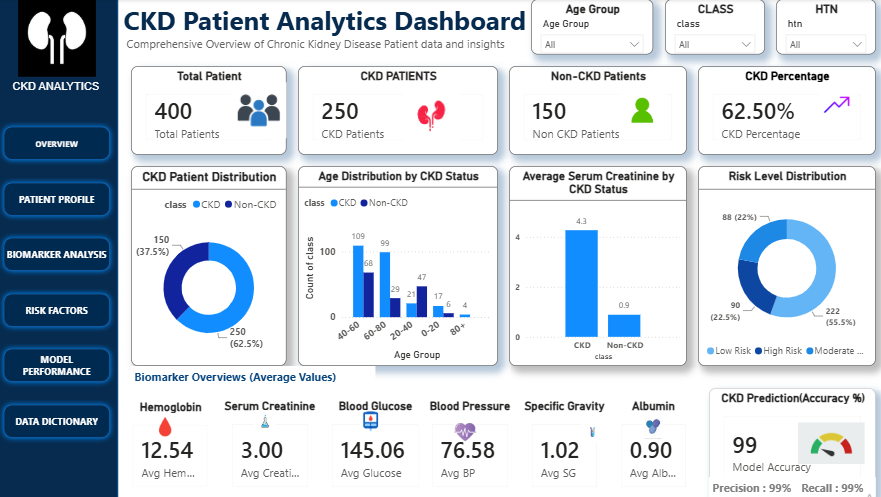
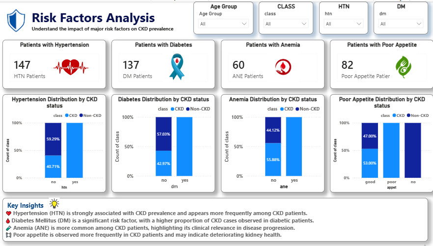
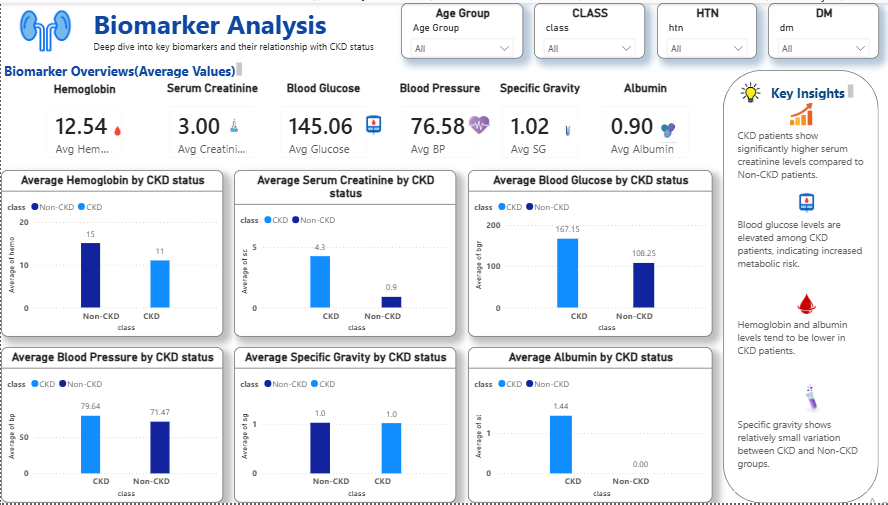
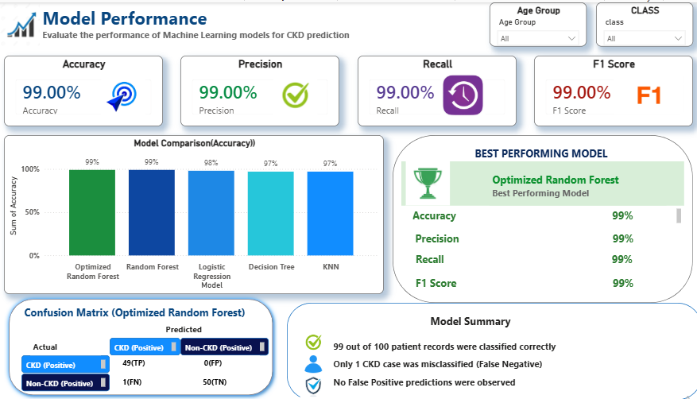
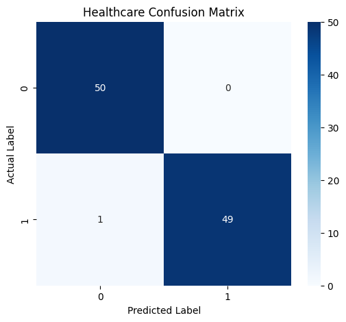

### Interactive Dashboard File

- Power BI Dashboard: `dashboard/powerbi/CKD_Dashboard.pbix`

# 🏥 Healthcare Chronic Kidney Disease (CKD) Prediction & Analytics

## 📌 Project Overview

This project focuses on analyzing Chronic Kidney Disease (CKD) patient data using Data Analytics, Machine Learning, and Power BI. The objective is to identify key clinical risk factors, predict CKD cases, and build an interactive dashboard that provides meaningful healthcare insights for decision-making.

---

## 🎯 Business Problem

Chronic Kidney Disease (CKD) is a serious health condition that often progresses silently until advanced stages. Early identification of high-risk patients can support timely medical intervention and improve patient outcomes.

This project aims to:

- Analyze patient health records
- Identify important CKD biomarkers
- Predict CKD using Machine Learning
- Visualize healthcare insights through Power BI

---

## 📊 Dataset Overview

**Dataset Source:** UCI Chronic Kidney Disease Dataset

| Metric | Value |
|----------|----------|
| Total Patients | 400 |
| CKD Patients | 250 |
| Non-CKD Patients | 150 |

### Clinical Features

- Age
- Blood Pressure (BP)
- Specific Gravity (SG)
- Albumin (AL)
- Blood Glucose Random (BGR)
- Blood Urea (BU)
- Serum Creatinine (SC)
- Hemoglobin (HEMO)
- Hypertension (HTN)
- Diabetes Mellitus (DM)
- Anemia (ANE)
- Appetite

---

## 🔄 Project Workflow

```text
Data Collection
      ↓
Data Cleaning & Preprocessing
      ↓
Exploratory Data Analysis (EDA)
      ↓
Feature Engineering
      ↓
Machine Learning Modeling
      ↓
Model Evaluation
      ↓
Power BI Dashboard Development
```

---

## 🛠️ Tech Stack

### Programming & Analytics

- Python
- Pandas
- NumPy

### Machine Learning

- Scikit-Learn
- Logistic Regression
- Decision Tree
- K-Nearest Neighbors (KNN)
- Random Forest
- Optimized Random Forest

### Visualization

- Matplotlib
- Seaborn
- Power BI

### Development Tools

- Jupyter Notebook
- VS Code
- Git
- GitHub

---

## 📈 Exploratory Data Analysis

The dataset was analyzed to understand patient characteristics, biomarker distributions, and disease patterns.

Key analyses included:

- Missing value analysis
- CKD class distribution
- Biomarker distribution analysis
- Correlation analysis
- Outlier detection
- Disease vs Non-Disease comparisons

---

## ⚙️ Data Preprocessing

The following preprocessing steps were performed:

- Missing value handling
- Invalid value correction
- Data type conversion
- Categorical encoding
- Feature scaling
- Dataset validation
- Data leakage detection and removal (`id` column removed)

---

## 🤖 Machine Learning Models

The following models were developed and evaluated:

- Logistic Regression
- Decision Tree
- K-Nearest Neighbors (KNN)
- Random Forest
- Optimized Random Forest (GridSearchCV)

---

## 🏆 Model Performance

| Model | Accuracy |
|---------|---------|
| Logistic Regression | 98% |
| Decision Tree | 97% |
| KNN | 97% |
| Random Forest | 99% |
| Optimized Random Forest | 99% |

### Best Performing Model

**Optimized Random Forest**

| Metric | Score |
|----------|----------|
| Accuracy | 99% |
| Precision | 99% |
| Recall | 99% |
| F1 Score | 99% |

---

## 📊 Confusion Matrix Summary

| Metric | Value |
|----------|----------|
| True Positives (TP) | 49 |
| True Negatives (TN) | 50 |
| False Positives (FP) | 0 |
| False Negatives (FN) | 1 |

### Model Interpretation

- Correctly classified 99 out of 100 patients
- Very low classification error
- Strong CKD detection capability
- Minimal false negative risk

---

## 📊 Power BI Dashboard

The project includes a multi-page interactive Power BI dashboard.

### 1️⃣ Patient Overview

- Total Patients
- CKD Distribution
- Age Distribution
- Risk Distribution
- Biomarker Summary

### 2️⃣ Biomarker Analysis

- Hemoglobin Analysis
- Serum Creatinine Analysis
- Blood Glucose Analysis
- Blood Pressure Analysis
- Clinical Insights

### 3️⃣ Risk Factors Analysis

- Hypertension (HTN)
- Diabetes Mellitus (DM)
- Anemia (ANE)
- Appetite Analysis
- Risk Insights

### 4️⃣ Model Performance

- Accuracy Comparison
- Precision
- Recall
- F1 Score
- Confusion Matrix Summary
- Model Insights

---

## 🔍 Key Findings

- CKD patients exhibited significantly higher serum creatinine levels.
- Blood glucose levels were elevated among CKD patients.
- Hypertension showed a strong association with CKD prevalence.
- Hemoglobin and albumin levels were lower among CKD patients.
- Optimized Random Forest achieved the best predictive performance.

---

## 📂 Project Structure

```text
healthcare-chronic-disease-analysis/
│
├── data/
│   ├── raw/
│   └── processed/
│
├── notebooks/
│
├── models/
│
├── reports/
│
├── dashboard/
│   ├── dashboard_images/
│   └── powerbi/
│
├── requirements.txt
├── README.md
└── .gitignore
```

---

## 🚀 How to Run the Project

### 1. Clone the Repository

```bash
git clone https://github.com/premprakash123/healthcare-chronic-disease-analysis.git
```

### 2. Navigate to Project Directory

```bash
cd healthcare-chronic-disease-analysis
```

### 3. Install Required Libraries

```bash
pip install -r requirements.txt
```

### 4. Launch Jupyter Notebook

```bash
jupyter notebook
```

### 5. Run Project Notebooks

Execute notebooks in the following order:

```text
Data Cleaning
↓
EDA
↓
Feature Engineering
↓
Model Building
↓
Model Evaluation
```

### 6. Open Power BI Dashboard

Open:

```text
dashboard/powerbi/CKD_Dashboard.pbix
```

using Power BI Desktop.

---

## 📷 Dashboard Preview

Add dashboard screenshots here:

```markdown


```

---

## 💡 Skills Demonstrated

- Data Cleaning & Preprocessing
- Exploratory Data Analysis (EDA)
- Feature Engineering
- Machine Learning
- Model Evaluation
- Healthcare Analytics
- Data Visualization
- Power BI Dashboard Development

---

## 👨‍💻 Author

**Prem Prakash Sahu**

Data Analytics | Machine Learning | Power BI